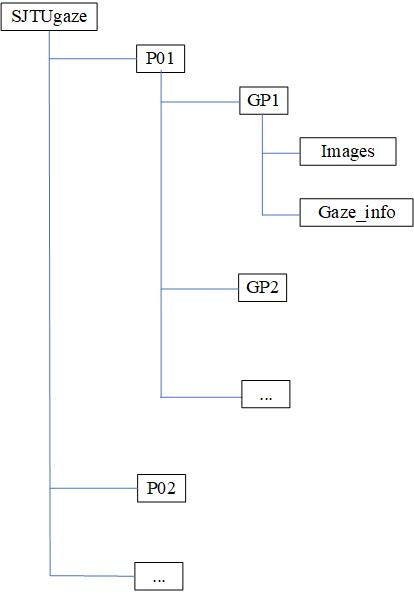

# SJTUgaze is a multiview dataset for gaze estimation collected by Shanghai JiaoTong University
## Abstract
we study the background and development of appearancebased gaze estimation which is currently a kind of mainstream gaze estimation method. There are some shortcomings in the field including scanty gaze dataset and poor ground-truth precision. Aiming at these, we present a new
SJTUgaze gaze dataset to enrich data for gaze estimation.
## Download
SJTUgaze is licensed under CC BY-NC-SA 4.0, commercial usage is not permitted.

You can download the SJTUgaze dataset from [SJTUgaze](https://drive.google.com/drive/folders/176IZS6RbEtLUaHYsisSjbazUV_8J4WWQ?usp=sharing). If you use our dataset in scientific publication, please cite the following paper:
```

```
## Collection Procedure
We show stimuli on a 47-inch LG LCD TV, the TV screen resolution is 1920 × 1080, the width and height are 104.1cm, 58.5cm. Then subjects watch these stimuli away from TV in 140 ∼ 175cm. 
four GoPro cameras are located on the top, down, left and right of the TV screen to capture subjects. The camera’s resolution is 2704 × 1520, and the frame rate is 60Hz. 
At the same time, we use the Tobii X120 eye tracker to track and record the subject’s gaze direction in real time, and based on this, the truth value labeling was carried out. The sampling rate of the Tobii X120 eye tracker is 60Hz. 
## Characteristics
SJTUgaze gaze dataset contains 127495 face images and corresponding ground-truth gaze directions from 16 subjects under 4 camera views. Compared with existing gaze datasets, SJTUgaze has following Characteristics:
* SJTUgaze uses Tobii X120 eye tracker to record the 3D eye positions of subjects and their corresponding gaze points on the screen. By accurately synchronizing the videos and eye tracker data, face images of corresponding frames are extracted, and the Tobii gaze data is transformed from the user coordinate system of the eye tracker to the camera coordinate system according to the equipment calibration information. So SJTUgaze has more accurate and reliable gaze direction vector labels. 
* SJTUgaze covers wider head pose and gaze direction range. We place four GoPro cameras locating left, right, above and down the television screen to record real-time videos when subjects watch stimuli 140 ∼ 175𝑐𝑚 away from TV screen to produce various head poses as much as possible. In this way, SJTUgaze can get plenty of face images with different head poses. 
* Based on four camera views, SJTUgaze is a multiview gaze dataset, which makes up for the current scarce multiview gaze data which can be used for multiview gaze estimation research. 
* In addition, in the data collection process of SJTUgaze, subjects are allowed to move their heads freely, which is more realistic and natural. SJTUgaze also has additional eye movement event category labels, which can play a role in related researches beyond gaze estimation.
here are some gaze samples:

## File Structure
The SJTUgaze gaze dataset contains 16 subjects. The whole dataset is organized according to subjects. 


every subjects includes face iamges and gaze_info.xlsx file.
### gaze_info file instruction
**TimestampInTobiirecord**: the timestamp in tobii recoding(i.e. RecordingTimestamp)  the image corresponding to

**FrameInVideo**:	which frame in video the images belong to

**EyeLocationLeftX**:	X axis coordination of left eye in image coordination (pixel)

**EyeLocationLeftY**:	Y axis coordination of left eye in image coordination (pixel)

**EyeLocationRightX**: 	X axis coordination of right eye in image coordination (pixel)

**EyeLocationRightY**: 	Y axis coordination of right eye in image coordination (pixel)

**GazeVectorLeftX**:	X axis coordinate of gaze vector of left eye in camera coordination

**GazeVectorLeftY**:	Y axis coordinate of gaze vector of left eye in camera coordination

**GazeVectorLeftZ**:	Z axis coordinate  of gaze vector of left eye in camera coordination

**GazeVectorRightX**:	X axis coordinate of gaze vector of right eye in camera coordination

**GazeVectorRightY**:	Y axis coordinate of gaze vector of right eye in camera coordination

**GazeVectorRightZ**:	Z axis coordinate  of gaze vector of right eye in camera coordination

**HeadPoseYaw**: 	Yaw angle of estimated head pose (degree)

**HeadPosePitch**: 	Pitch angle of estimated head pose (degree)

**HeadPoseRoll**: 	Roll angle of estimated head pose (degree)


**CropUpLeftX**:	X axis coordinate of upper left of cropping box in the origin video image (pixel), just as the $P_{crop}$ point in above image

**CropUpLeftY**:	Y axis coordinate of upper left of cropping box in the origin video image (pixel)

**Status**:		1 fixation，2 scaccade， 3 others

**Environment**:	0 light off, 1 light on

**EyelocationLeftX(C)**：X axis coordinate of left eye in camera coordination (mm)

**EyelocationLeftY(C)**：Y axis coordinate of left eye in camera coordination (mm)

**EyelocationLeftZ(C)**：Z axis coordinate of left eye in camera coordination (mm)

**EyelocationRightX(C)**：X axis coordinate of right eye in camera coordination (mm)

**EyelocationRightY(C)**：Y axis coordinate of right eye in camera coordination (mm)

**EyelocationRightZ(C)**：Z axis coordinate of right eye in camera coordination (mm)
***
### Note
Due to some collection problem, some subjects may lack some camera view data, such as subject P11 lacks  GP2 camera data. And subject P12 data is splited into two files, you should read these two files together.

## Enjoy it!